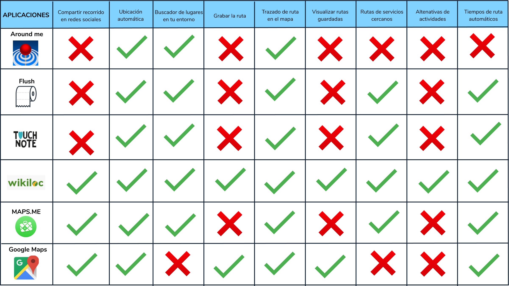
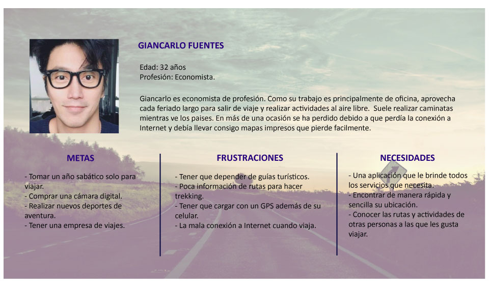

# OUTDOOR

Outdoor es una aplicación para los amantes de la aventura, el aire libre y la naturaleza. Encuentra, graba y compate tus rutas. Ubica servicios y lugares turísticos cercanos a ti; te ayudamos a elegirlos de acuerdo al tiempo estimado de llegada. 
Como sabemos que estarás al aire libre, puedes descargar tus rutas y tenerlas en tu celular sin preocuparte por la conexión a Internet.
Disfruta del estado Outdoor.

# **RESEARCH**

## Entrevistas

### Guía de entrevista a los usuarios.

1. ¿Haces actividades al aire libre?
2. ¿Sueles viajar?
3. ¿Cómo decides a qué lugares viajar?
4. ¿Quienes te acompañan en tus viajes?
5. ¿Cómo decides a dénde viajar?
6. ¿Consultas alguna aplicación antes o durante tu viaje? ¿Por qué? ¿Qué beneficios te da?
7. Si no utilizas ninguna, cuéntamos por qué.
8. ¿Qué actividades te gusta realizar cuando viajas?
9. ¿Notificas a alguna persona cuando llegas a tu destino? ¿A quién? ¿Cómo lo haces?
10. Si no lo haces, cuéntamos el por qué.
11. ¿Compartes los recuerdos de tus viajes en redes sociales? ¿Cuáles?

### Entrevistas realizadas

1. **Entrevista Jean Carlo**

Edad: 35
Profesión: Profesional de Marketing

[Giancarlo](https://docs.google.com/presentation/d/1C1uxFMI5upQHzpqgO0Y8k8PEFb9z7ZSu8dZZjA8OgEQ/edit?usp=sharing)

2. **Entrevista Rocío**

Edad: 21
Profesión: estudiante

[Rocío](https://docs.google.com/presentation/d/1dSuGN-A3hd0djoG3d74doMmSCXUFutPqpNWY789_pj4/edit?usp=sharing)

3. **Entrevista Alejandra**

Edad: 25 años.
Profesión: Training Manager

[Alejandra](https://docs.google.com/presentation/d/1oAfouN8p3xMu0AXDmVfWEnPyt2VmSAA6-LEh_vN_Wu4/edit?usp=sharing)

## Encuesta Online:

### **Conclusiones de la encuesta online**

- El 62% de los encuestados a realizado algún turismo de aventura.
- La actividad más realizada es caminatas (65%).
- Lo que les impulsó a realizar estas actividades fue el mismo hecho de viajar y en algunos casos, por recomendación.Solo un 13% lo hace por hobby.
- La búsqueda de información sobre estas actividades se hace principalmente en Internet en un 87%
- Para los usuarios es de mucha importancia la opinión de otras personas.
- En un 87%, las personas suelen llamar a un familiar o amigo, para notificar que llegó a su destino.
- Los servicios que a las personas le interesa conocer su ubicación son: hoteles, restaurantes y lugares turísticos. Y para encontrar estos servicios, suelen buscar los datos en Internet o consultar a una persona del lugar.
- Para decidir a que lugar ir de un servicio determinado, la persona se guía de las opiniones y experiencias de otros usuarios. 

### Gráficos de los resultados de la encuesta.

## **Benchmarck**

# **ANÁLISIS DE DATOS**

## **Problem Statements**

En el proceso de investigación, encontramos el problema de que los usuarios suelen utilizar Google Maps para sus viajes, ya que les brinda la información que necesitan. Por tanto nuestro enfoqué se centró el ofrecer un servicio más completo.

## **HMW**

- ¿Cómo podríamos brindar agrupar las rutas de acuerdo a cada actividad?
- ¿Cómo podríamos generar una aplicación que intregre servicios, rutas y turismo?
- ¿Cómo podríamos mostrar un flujo de manera sencilla y directa?

# **PROPUESTA DE PRODUCTO**

Nuestra propuesta es una aplicación destinado a los que les encanta viajar y vivir experiencias de aventura y salir del turismo tradicional. En una sola aplicación ofrecemos la búsqueda de rutas por actividad, servicios y atracciones que se pueden encontrar a lo largo de la ruta. 

## **User persona**

## **FEATURE LIST**

### Priorización

## Paper prototyping 

### Testing del Paper prototyping

# ITERACIÓN

## Modificaciones y puntos de mejora

## Prototipo de Alta fidelidad

[Outdoor]()

## User flow

[User Flow](https://docs.google.com/presentation/d/1KSLhnJD7F85ECQSR1zEHPnqywCaOtG3UM9KNIhhWYzw/edit?usp=sharing)

## Modelo del producto

# SEGUNDA ITERACIÓN

## Testing del prototipo de alta fidelidad.

## Modificaciones y puntos de mejora

## Propuesta final.

## Implemetaciones a futuro.

# HERRAMIENTAS UTILIZADAS

